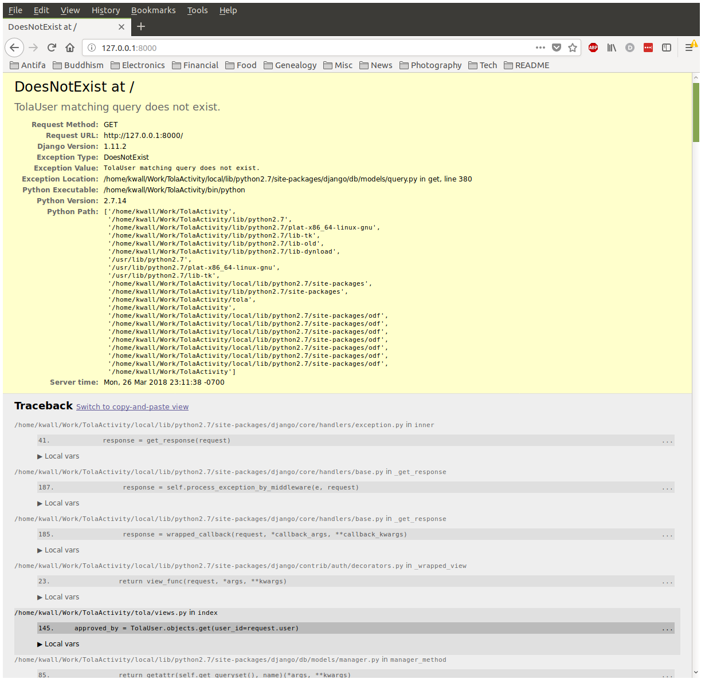

# [Tola Activity](http://toladata.com/products/activity/)
[](https://travis-ci.org/toladata/TolaActivity)

[TolaActivity](http://www.github.com/toladata/TolaActivity) extends
the functionality of [TolaData](https://www.toladata.com/) to include a
set of forms and reports for managing project activities for a Program. It
includes workflow for approving and completing projects as well as sharing
the output data. TolaActivity functionality is intended to allow importing
and exporting of project-specific data from 3rd party data sources or
excel files.

# Creating a local TolaActivity instance

Running a local instance of TolaActivity makes development much faster and
eliminates your dependence on access to any of MC's TolaActivity instances.
These instructions should get you up and running with a minimum of fuss if
you have [macOS](#macos) or one of the man [Ubunten](#ubunten). If they do
not, pull requests accepted.

## Install the bits

TolaActivity requires Python 2. MC uses MySQL as Django's datastore.

### macOS

On macOS, you can use Homebrew to install Python 2 alongside the system
Python 2 installation as shown in the following:

```bash
$ brew install python@2
$ brew install pip
$ brew install mysql mysql-utilies
$ brew install py2cairo pango
$ git clone https://github.com/mercycorps.org/TolaActivity.git
$ git checkout dev
$ virtualenv TolaActivty --no-site-packages
$ cd TolaActivity
$ source bin/activate
$ mkdir config
# Place settings.secret.yml into config/ directory
$ pip install -r requirements.txt
$ pip install --upgrade google-api-python-client
```

Edit the configuration file as described in
[Modify the config file](#modify-the-config-file).

### Ubunten

On Ubuntu and its derivatives, Python 2 is the default, so the
following should get you going on any current Python 2 version for most
Ubuntu-family distros (_Ubunten_):

```bash
$ python --version
$ # Make sure output from above indicates Python 2
$ sudo apt install mysql-server libmysqld-dev mysql-utilities mysql-client
$ git clone https://github.com/mercycorps.org/TolaActivity.git
$ git checkout dev
$ virtualenv TolaActivty --no-site-packages
$ cd TolaActivity
$ source bin/activate
$ mkdir config
# Place settings.secret.yml into config/ directory
$ pip install -r requirements.txt
$ pip install --upgrade google-api-python-client
```

Edit the configuration file as described in
[Modify the config file](#modify-the-config-file).

## Modify the config file

Edit _config/settings.secret.yml_. Find the node named, "DATABASES" and set the 
database `PASSWORD` as appropriate. The result should resemble the following:

```yaml
32 DATABASES:
33  default:
34    ENGINE: "django.db.backends.mysql"
35    NAME: "tola_activity"
36    USER: "admin"
37    PASSWORD: "SooperSekritWord"
38    OPTIONS: {"init_command": "SET default_storage_engine=MYISAM",}
39    HOST: "localhost"
40    PORT: ""
```

Don't change the `USER` entry unless you know why you need
to do that. Save and exit.

## Set up Django's MySQL backing store

```sql
CREATE DATABASE 'tola_activity';
CREATE USER 'admin';
GRANT ALL ON tola_activity.* TO 'admin'@'localhost' IDENTIFIED BY 'SooperSekritWord';
```

## Set up Django

Set up the Django database:

```bash
$ python manage.py migrate

Operations to perform:
  Apply all migrations: admin, auth, authtoken, contenttypes, customdashboard, formlibrary, indicators, reports, sessions, sites, social_django, workflow
  Running migrations:
  Applying contenttypes.0001_initial... OK
  Applying auth.0001_initial... OK

  [output deleted]

  Applying workflow.0014_remove_stakeholder_sector... OK
  Applying workflow.0015_stakeholder_notes... OK
  Applying workflow.0016_auto_20170623_1306... OK
```

Start the server:

```bash
$ python manage.py runserver
Performing system checks...

System check identified 1 issue (0 silenced).
March 20, 2018 - 11:51:55
Django version 1.11.2, using settings 'tola.settings.local'
Starting development server at http://0.0.0.0:8000/
Quit the server with CONTROL-C.
```

## Configuring OAuth authentication

When running a local instance, we use Google's OAuth API for
authentication to TolaActivity. There exists a bug in the API library
that requires an ugly manual workaround before you can actually log in
and starting using TolaActivity. The following procedure is a workaround
for this bug until the bug is well and truly crushed.

1. Start the TolaActivity server as described in the previous section
1. Open the home page in a web browser
1. Click the "Google+" link below the login button to authenticate with
   Google OAuth 
1. Login as normal using your MercyCorps SSO login
1. What _should_ happen is that you get logged in and redirected to
   to the TolaActivity home page. Likely as not, though, you'll get
   a screen remarkably similar to the one in the following figure.
   You guessed it, that means you've hit the bug.
   
1. Stop the TolaActivity server
1. Open a MySQL shell and connect to the tola_activity database
1. Get the id of the record Google OAuth added to the TolaActivity
   user table:

    ```bash
    mysql> select id,username,first_name,last_name from auth_user;
    +----+----------+------------+-----------+
    | id | username | first_name | last_name |
    +----+----------+------------+-----------+
    |  1 | kwall    | Kurt       | Wall      |
    +----+----------+------------+-----------+
    ```
    
    Note the value for `id` to use in the next step.

1. Insert the `id` value from the `auth_user` table into the `user_id` field
   of the `workflow_tolauser` table:

    ```sql
    INSERT INTO workflow_tolauser (privacy_disclaimer_accepted, user_id) VALUES (1,1);
    ```

1. Restart the Tola Activity server

    ```bash
    $ python manage.py runserver
    Performing system checks...

    System check identified no issues (0 silenced).
    March 26, 2018 - 23:38:10
    Django version 1.11.2, using settings 'tola.settings.local'
    Starting development server at http://127.0.0.1:8000/
    Quit the server with CONTROL-C.
    ```

1. Refresh the browser window and you should be at the logged in and immediately
   redirected to the TolaActivity home page
1. Rejoice!

## Loading demo data

1. Get a recent dump from the demo instance from someone
1. Kill the TolaActivity server
1. Make a backup of the current tola_activity DB if it's precious
1. Drop and recreate the tola_activity DB:

   ```sql
   DROP DATABASE 'tola_activity';
   CREATE DATABASE 'tola_activity';
   ```

1. Execute the SQL script you were given to load the data:

   ```bash
   $ mysql -u root -p tola_activity < demo_data.sql
   ```
